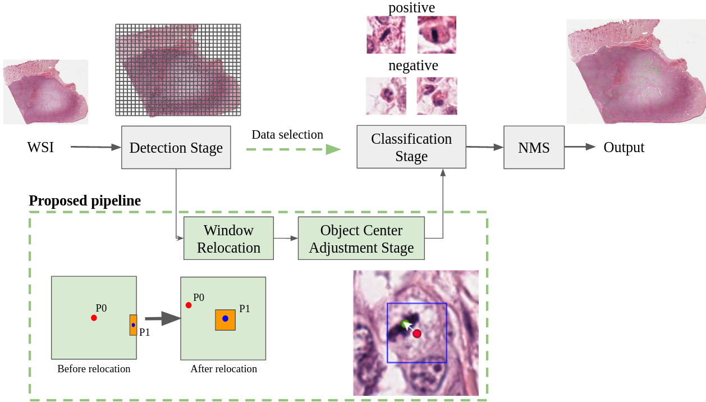

# ReCasNet
Implementation of ReCasNet: Improving consistency within the two-stage mitosis detection framework.

This git contains two main directories: `detection/` and `classification/`.

The directory `detection/` contains the socure code of a detection and window relocation stage. For enviroment setup and usage guide is in this <a href="https://github.com/cmb-chula/ReCasNet/tree/master/classification" title="">link</a>.

The directory `classification/` contains the socure code of an object center adjustment stage, classification stage, and evalutaion code. For enviroment setup and usage guide is in this <a href="https://github.com/cmb-chula/ReCasNet/tree/master/classification" title="">link</a>.

Each directory use different environment. The detection stage is based on MMDetection, an object detection framework based on PyTorch, while the object center adjustment and classification stage are based on tensorflow. 

